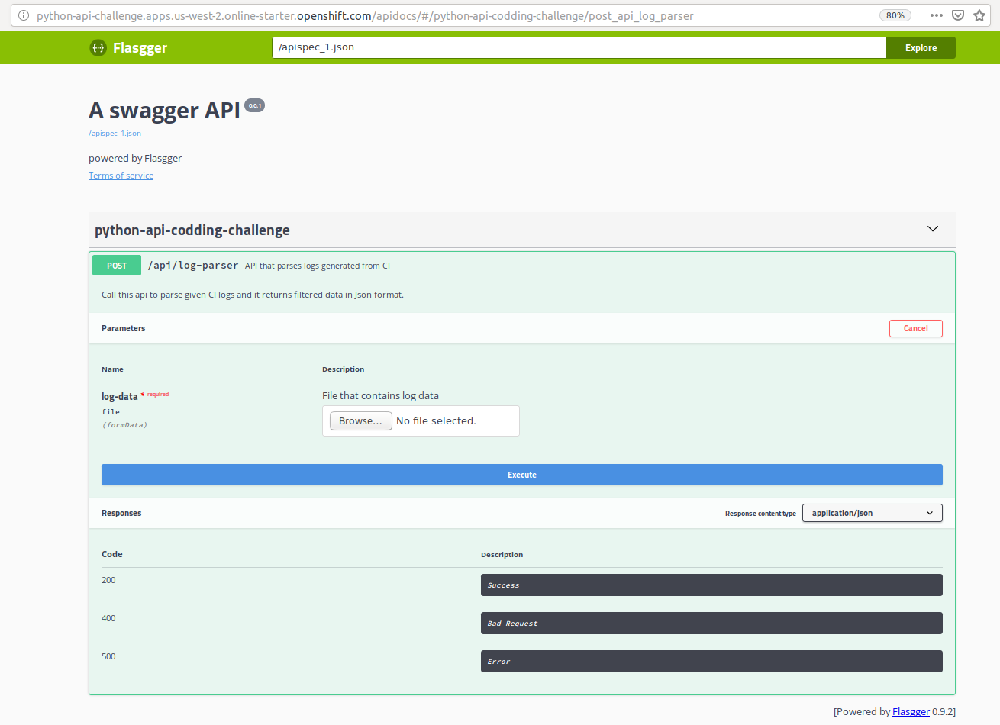

# python-api-coding-challenge

This is python project, having one api that parses CI logs and give result in json format. In this code we used few frameworks listed below.
* **Flask** for rest api
* **flasgger** for OpenAPI documentation(swagger)
* **gunicorn** for WSGI HTTP Server
* **pytest** for unit testing  


### Steps to Run Project  
#### Option1 : Run through terminal locally 
Go to project folder and run below commands.
```bash
pip3 install -r requirements.txt
gunicorn --workers=2 -b 0.0.0.0:5000 run:app
```
worker=2 means 2 process/worker will run for this command, and it will host into 5000 port.
#### Option2 : Build and run using docker image locally
Step1: Go to project folder.

Step2: Build docker image with name as "api-challenge"
```bash
docker build -t api-challenge .
```
Step3: Verify created docker image and Note the 'IMAGE ID' of created image
```bash
docker images
```
Step4: Run docker image on port 5000 by giving docker image id that we got it from earlier command. 
```bash
docker run -p 5000:5000 <image id>
```
#### Option3 : Pull image from docker hub and run it
Step1: Pull docker image created from this code and hosted into docker hub using below command. 
```bash
docker pull rajusem/api-challenge
```
Step2: Verify image using below command. 
```bash
docker images
```
Step3: Run docker image on port 5000 by giving docker image id that we got it from earlier command. 
```bash
docker run -p 5000:5000 <image id>
```

### API to parse CI Logs
```bash
POST /api/log-parser
content-type: multipart/form-data
parameters:
  log-data : file which contains CI logs 
```

### Swagger UI



### Test application using Swagger UI
You can test the same using Swagger UI by following below steps. 
1. Open swagger UI locally by opening url "http://127.0.0.1:5000/apidocs/#/python-api-codding-challenge/post_api_log_parser" into browser.
<s>(Hosted api into **openshift** platform : http://python-api-challenge.apps.us-west-2.online-starter.openshift.com/apidocs/#/python-api-codding-challenge/post_api_log_parser (Deprecated as trial subscription expired))</s>
2. Click on **Try it out** button 
3. Browse CI log file from your system and select the same. (Download sample CI logs from [here](https://github.com/rajusem/python-api-coding-challenge/blob/master/api/test-data/data.txt)) 
4. Click on **Execute** button
